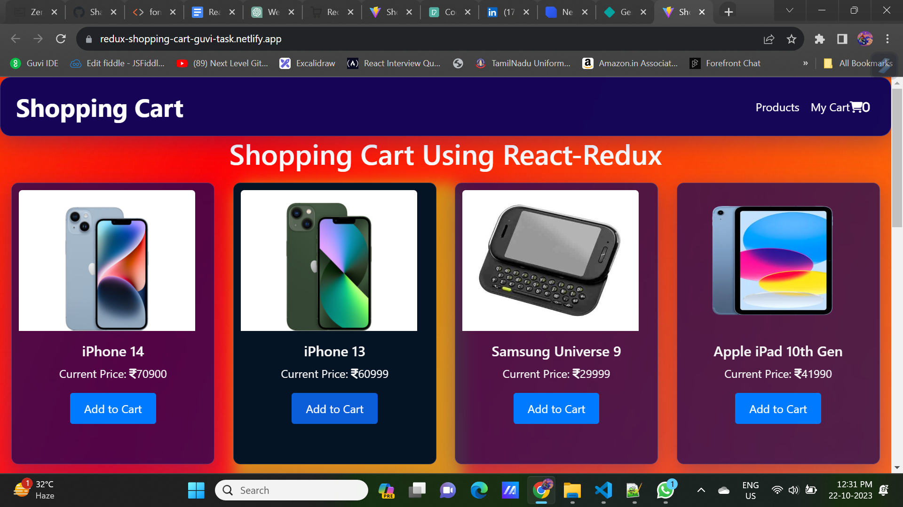

# Redux Shopping Cart Website

## Overview

This project is a shopping cart website built with HTML, CSS, React, and Redux. It allows users to browse a list of products, add them to their cart, and manage their cart. This README provides an overview of the project's structure, features, and how to get it up and running.

## Features

- **Product Listing:** Display a list of products with details like title, price, and an option to add them to the cart.

- **Shopping Cart:** Maintain a shopping cart where users can add and remove products.

- **Total Price Calculation:** Calculate and display the total price of products in the cart.

- **Responsive Design:** The website is responsive, ensuring a good user experience on different devices.

- **Navigation:** Easily switch between the product listing and the shopping cart using the navigation menu.

- **GitHub Links:** Links to the project creator's GitHub and LinkedIn profiles.

## Demo

Check out the live demo of the project [here](https://redux-shopping-cart-guvi-task.netlify.app/).

## Screenshots

Include a few screenshots of your website in this section to give users a visual impression of your project.

## Getting Started

### Prerequisites

- Node.js and npm should be installed on your system.

### Installation

1. Clone the repository: `git clone https://github.com/Shanmugamrskfamily/react-redux-task.git`
2. Change to the project directory: `cd react-redux-task`
3. Install dependencies: `npm install`
4. Start the development server: `npm start`
5. Open your web browser and visit `http://localhost:3000` to see the project locally.

## Usage

- Navigate to the website and start exploring products.
- Add items to your shopping cart.
- Visit the cart page to review and manage your cart.

## Contributing

If you'd like to contribute to this project, please follow these steps:

1. Fork the repository.
2. Create a new branch for your feature or fix: `git checkout -b feature-name`
3. Make your changes and commit them.
4. Push to your fork: `git push origin feature-name`
5. Create a pull request to the main repository.

## Author

- [SHANMUGAM R](https://github.com/Shanmugamrskfamily/)
- <i class="fa fa-linkdln"></i>[LinkedIn Profile](https://www.linkedin.com/in/shanmugamrskfamily/)

## License

This project is licensed under the MIT License - see the [LICENSE](LICENSE) file for details.
